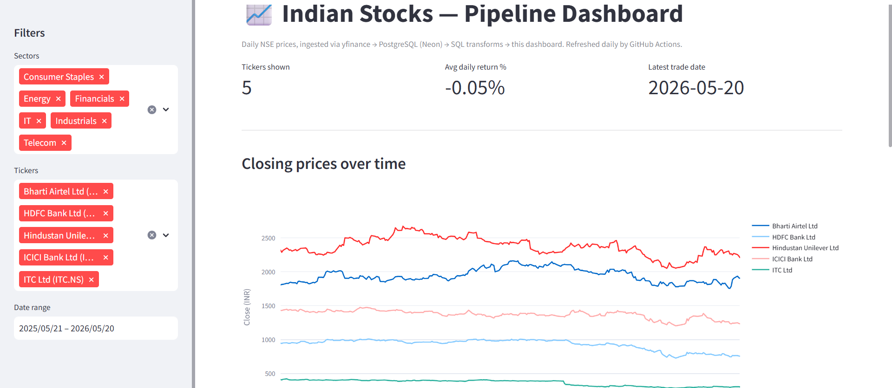

# Indian Stock Market Data Pipeline

> An end-to-end data pipeline that ingests daily NSE market data on a
> schedule, lands it in a cloud PostgreSQL database, transforms it with
> SQL into analytics-ready tables, validates it with data-quality
> checks, and serves it through a live Streamlit dashboard.

**Live dashboard:** _<link once deployed>_



---

## What this project does and why

This project demonstrates end-to-end data-engineering fundamentals on a
single coherent domain: scheduled ingestion, raw / clean separation,
dimensional modelling, data quality, and a deployed dashboard.

A scheduled GitHub Actions job runs every weekday evening. It fetches a
year of OHLCV data for a basket of Nifty large-caps from yfinance, lands
the rows in a Postgres landing zone, transforms them with SQL into a
clean fact + dimension model, computes daily returns and a 7-day moving
average, runs six data-quality checks, and exits non-zero if anything
looks stale or malformed. A Streamlit dashboard reads the clean tables
and exposes the data with sector / ticker / date filters.

The project is deliberately small — ten tickers, three tables, ~2,500
rows — because the goal is to show the *engineering shape* of a pipeline
clearly, not to scale it.

## Architecture

```
yfinance (NSE tickers with .NS suffix)
        |
        v
Extract (Python)  --->  raw_prices            (landing zone, immutable)
        |
        v
Transform (SQL)   --->  dim_stock              (dimension, upserted from YAML)
                        fact_daily_prices      (clean fact + derived metrics)
        |
        v
Quality checks    --->  emptiness, coverage, freshness, nulls, sanity, uniqueness
        |
        v
Streamlit dashboard  (reads only the clean tables)

Orchestrated by GitHub Actions on a weekday schedule (14:00 UTC / 19:30 IST).
```

## Tech stack and why each piece

| Layer        | Choice                       | Why |
|--------------|------------------------------|-----|
| Ingestion    | Python + `yfinance`          | Stable Yahoo-backed source; NSE/BSE via `.NS`/`.BO` suffix |
| Database     | PostgreSQL (Neon)            | Industry-standard SQL; free cloud tier reachable by CI and dashboard |
| Transform    | SQL window functions         | The right tool for set-based modelling and derived metrics |
| Orchestration| GitHub Actions (cron)        | Free, cloud-hosted, no local machine required |
| Quality      | Python checks                | Fails the build on stale, missing, or malformed data |
| Dashboard    | Streamlit + Plotly           | Fast to build, deploys free, single-language repo |

## Data model

A star-schema-lite design: one fact table, one dimension.

- **`raw_prices`** — verbatim landing zone for each yfinance pull.
  Never modified after insert. The clean layer can always be rebuilt
  from raw if transform logic changes. A unique constraint on
  `(symbol, trade_date)` powers idempotent inserts.
- **`dim_stock`** — dimension: symbol, company name, sector, exchange.
  Upserted from `config/stocks.yaml` on every run — the YAML is the
  source of truth for what's tracked.
- **`fact_daily_prices`** — clean fact table. One row per symbol per
  trading day, joined to `dim_stock`, with derived metrics:
  - `daily_return_pct` — day-over-day percentage change
  - `ma_7` — 7-day trailing moving average of close
  Fully rebuilt each run, which keeps history correct if the transform
  is ever fixed.

## Design decisions worth highlighting

- **Swappable data source.** Extraction sits behind a `PriceDataSource`
  interface in `extract/data_source.py`. The current implementation is
  `YFinanceSource`; swapping to a REST API or a paid feed is one new
  class, no changes elsewhere.
- **Incremental loading.** Each run queries the latest stored
  `trade_date` per ticker, then fetches only the gap. First run does a
  backfill controlled by `BACKFILL_DAYS`.
- **Idempotency.** `INSERT ... ON CONFLICT (symbol, trade_date) DO NOTHING`
  on `raw_prices` means re-running the pipeline the same day is a no-op.
- **Raw / clean separation.** Raw data is immutable. All
  transformation logic lives in SQL files under `transform/sql/`.
- **Defensive extract layer.** Drops partial NaN-OHLC rows (a yfinance
  intraday quirk), retries empty responses with exponential back-off,
  enforces a polite delay between tickers, and continues past
  individual ticker failures rather than aborting the whole run.
- **Data-quality gate.** Six checks (emptiness, ticker coverage,
  freshness, no-null OHLC, high≥low, no duplicates) run after every
  pipeline invocation. Failures exit non-zero so the GitHub Actions
  run shows red — silent staleness is the failure mode this guards
  against.

## Data source evaluation

The data source was chosen after evaluating three options:

1. **Finnhub REST API.** Free tier does not cover Indian exchanges.
2. **Community NSE/BSE REST APIs.** Candidates were either unmaintained
   scrapers of NSE pages (likely to break without warning) or
   documentation-only repos pointing at a single hobby-hosted server
   with no SLA. Too fragile for a pipeline meant to run for months
   unattended.
3. **yfinance.** Library, not REST. Backed by Yahoo Finance, which has
   served Indian market data reliably for years. Chosen for stability
   while structuring the extract layer so a REST source could be added
   later without rewrites.

A real wrinkle surfaced during development: yfinance's default
`Ticker.history()` path has become prone to empty-response failures
from Yahoo's rate-limiter. The extract layer was rewritten to use
`yf.download()` (a different Yahoo endpoint, currently more reliable),
with retries and a 2.5-second inter-ticker delay. This is the kind of
real-world quirk a production pipeline has to handle.

## Running it locally

```bash
# 1. Create and activate a virtual environment
python -m venv .venv
source .venv/bin/activate          # Mac/Linux
# .venv\Scripts\Activate.ps1         # Windows PowerShell

# 2. Install dependencies
pip install -r requirements.txt

# 3. Configure environment
cp .env.example .env
#    fill in DATABASE_URL with your Neon connection string

# 4. Confirm the database connection works
python -m load.db

# 5. Run the pipeline
python -m extract.fetch_prices

# 6. Launch the dashboard
streamlit run dashboard/app.py
```

## Project structure

```
indian-stocks-pipeline/
├── config/          # stocks.yaml — the tracked basket
├── extract/         # data-source abstraction + extraction orchestration
├── transform/sql/   # SQL: create tables, build fact_daily_prices
├── load/            # database connection + helpers
├── quality/         # data-quality validations
├── dashboard/       # Streamlit app
├── docs/            # architecture diagram, dashboard screenshot
├── logs/            # pipeline logs (gitignored)
└── .github/         # scheduled GitHub Actions workflow
```

## Limitations and what I'd do next

- **No automated tests yet.** Unit tests for `data_source.py` (mocking
  yfinance) and integration tests for the SQL transforms against a
  temporary Postgres would be the immediate next addition.
- **Full-rebuild transform.** `fact_daily_prices` is rebuilt each run.
  Trivial at this scale; an incremental transform via `dbt` would be
  the natural next step.
- **No alerting.** Quality failures show as red Actions runs; piping
  them to email or Slack on failure would be a small lift.
- **Single source.** The `PriceDataSource` interface is in place but
  there is currently only one implementation. Adding a fallback
  source and a `try-then-fall-back` orchestrator would harden the
  pipeline against Yahoo outages.
- **The dashboard's date filter could be sharper.** Quick-select
  presets ("1M", "3M", "YTD") would be more useful than the raw
  calendar input.

---

_Built as a portfolio project to demonstrate end-to-end data engineering:
scheduled ingestion, dimensional modelling, data quality, and a deployed
dashboard._
